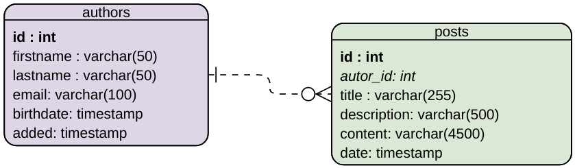

# JaxRS OData Examples

This repository contains some example to show how the [JaxRS OData](https://github.com/dometec/jaxrs-odata) library is used.

The demo creates an in memory database with this schema and a hundred of row for each table: 

When you start a demo project, and you can use curl to query the data (please attention to escape che "$" charter):

```
curl "http://localhost:8080/api/authors?\$top=10" -H "Accept: application/json"
```

```
curl "http://localhost:8080/api/authors?\$top=10&\$skip=0&\$filter=contains%28firstname,%20%27do%2%29&\$count=true" -H "Accept: application/json"
```

```
curl "http://localhost:8080/api/authors?\$top=10&\$skip=0&\$filter=contains(posts/title,'dolorem')&\$count=true" -H "Accept: application/json"
```

```
curl "http://localhost:8080/api/posts?\$top=10&\$skip=0&\$filter=author/id%20eq%201&\$count=true" -H "Accept: application/json"
```
