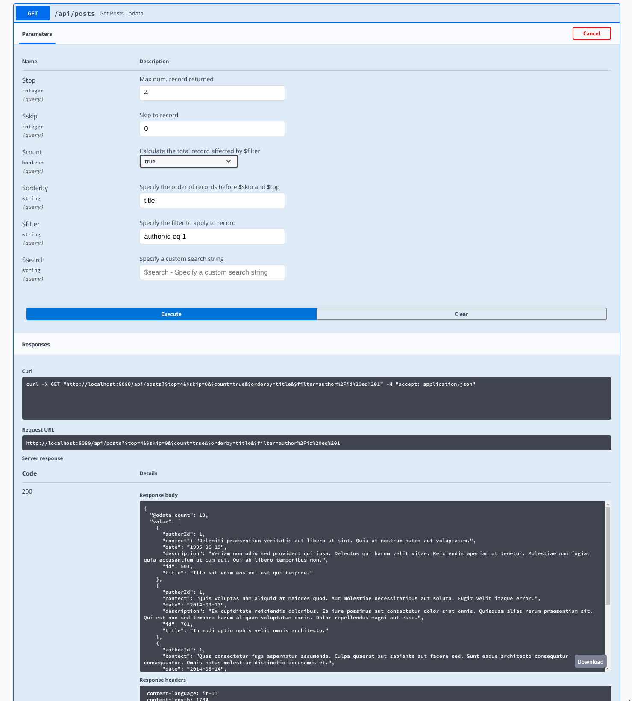

# Osys JaxRS OData Open Liberty Examples

This is an example of how to use [Osys JaxRSOData](https://github.com/dometec/jaxrs-odata) library with Quarkus.

If you want to learn more about Open Liberty, please visit its website: https://openliberty.io/.

## Running the application in dev mode

You can run your application in dev mode that enables live coding using:
```
mvn clean package
mvn liberty:dev
```

When started, some data are loaded into an in memory database, and you can use curl to query the data (please attention to escape che "$" charter)::

```
curl 'http://localhost:8080/api/authors?\$top=100' -H 'Accept: application/json'
```

```
curl 'http://localhost:8080/api/authors?\$top=10&\$skip=0&\$filter=contains%28firstname,%20%27do%27%29&\$count=true' \
  -H 'Accept: application/json'
```

```
curl 'http://localhost:8080/api/authors?$top=10&$skip=0&$filter=contains(posts/title,'dolorem')&$count=true' \
  -H 'Accept: application/json'
```

Check out many other exampe in [Osys JaxRSOData Test Class](https://github.com/dometec/jaxrs-odata/tree/master/src/test/java/it/osys/jaxrsodata)

You can also open the SwaggerUI and try some query:

http://localhost:8080/openapi/ui/


